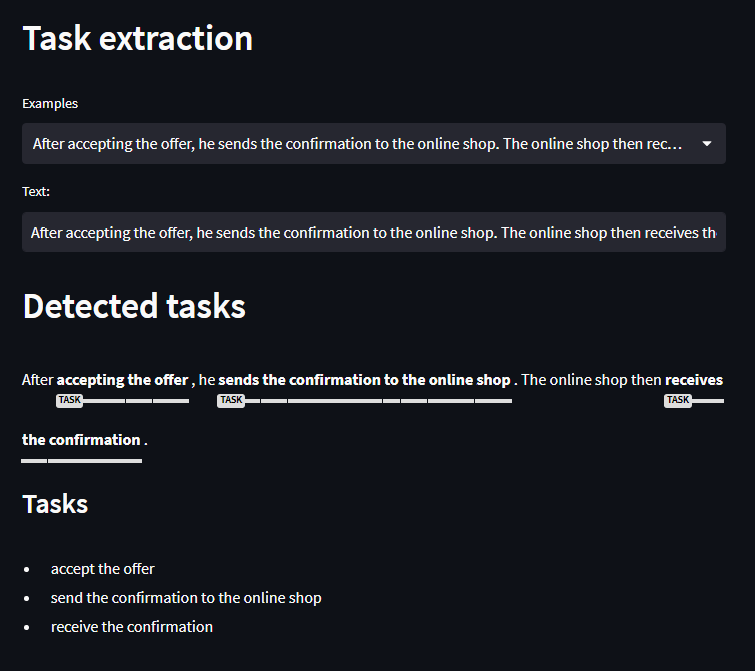

# spaCy Named Entity Recognition

  

An application built with [Streamlit](https://streamlit.io/) demonstrating the performance of a [spaCy](https://spacy.io/) model trained on a small dataset that consists of textual process descriptions.

The goal of the model is to select spans of text that represent tasks in a business process.

---

